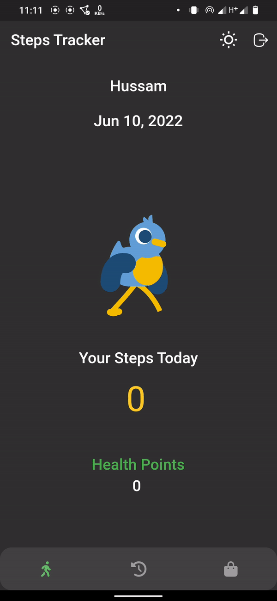

# Flutter Steps Tracker

A simple steps tracker using [pedometer](https://pub.dev/packages/pedometer).

|  |  |
| -------------------- | --------------------- |
### Project structure:

```
├─ lib
│  ├─ app.dart
│  ├─ common
│  │  ├─ app_manger
│  │  ├─ const.dart
│  │  ├─ extension.dart
│  │  ├─ permission_strategy.dart
│  │  └─ provider
│  ├─ features
│  │  ├─ pedometer
│  │  │  ├─ application
│  │  │  ├─ data
│  │  │  ├─ domain
│  │  │  └─ presentati
│  │  ├─ root
│  │  │  ├─ manager
│  │  │  ├─ permission_handler_widget.dart
│  │  │  ├─ root_screen.dart
│  │  └─ user
│  │     ├─ application
│  │     ├─ data
│  │     ├─ domain
│  │     └─ presentation
│  ├─ firebase_option
│  ├─ main.dart
│  ├─ resou
│  ├─ rout
│  ├─ service_locator
│  │  ├─ features
│  │  └─ service_locator.dart
│  └─ splash
├─ melos.yaml
├─ packages
│  ├─ bootstrap
│  ├─ core
│  └─ design
├─ pubspec.yaml
└─ spider.yaml
```

### Melos Scripts:

```yaml
name: flutter_steps_tracker

packages:
  - '*'
  - packages/**

scripts:
  format: melos exec -- "flutter format ."

  fix_hints: melos exec -- "dart fix —apply ."

  analyze:
    run: melos exec -- flutter analyze .
    description: Run `dart analyze` in all packages.

  easy_local:
    run: |
      melos exec --depends-on="easy_localization"  -- $easy &&
      melos exec --depends-on="easy_localization"  -- $easy -f keys -o locale_keys.g.dart
    env:
      easy: flutter pub run easy_localization:generate -S translations

  build_runner:
    run: |
      melos exec --depends-on="build_runner" --  $runner
    env:
      runner: flutter pub run build_runner build --delete-conflicting-outputs

  upgrade:
    run: melos exec flutter pub upgrade

  spider:
    run: |
      melos exec spider build
```
